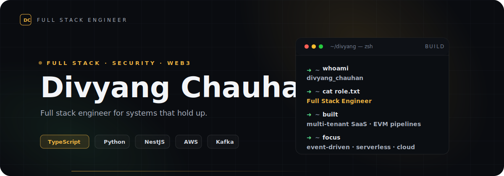

<p align="center">
  
</p>

<p align="center">
  <a href="https://www.divyang.dev">divyang.dev</a>
  &nbsp;·&nbsp;
  <a href="https://github.com/divyangchauhan">GitHub</a>
  &nbsp;·&nbsp;
  <a href="https://linkedin.com/in/divyangchauhan">LinkedIn</a>
  &nbsp;·&nbsp;
  <a href="mailto:divyang@divyang.dev">divyang@divyang.dev</a>
</p>

---

Backend engineer specializing in distributed systems, scalable APIs, and event-driven architecture.

### Selected Work

| Project                                                | Role                          | Notes                                                                                                                                                                                                                           |
| ------------------------------------------------------ | ----------------------------- | ------------------------------------------------------------------------------------------------------------------------------------------------------------------------------------------------------------------------------- |
| **NST Cyber Assure**                                   | Founding Engineer & Team Lead | Multi-tenant vulnerability-triage and threat-surface-management platform for banks. Took over a failed third-party build and rebuilt v1 from scratch, then owned the v2 rewrite off OutSystems to TypeScript on serverless AWS. |
| [**Tarpan**](https://github.com/divyangchauhan/Tarpan) | Solo · Open source            | SaaS that helps families handle the administrative aftermath of a death, powered by an LLM document pipeline.                                                                                                                   |
| **Hunter**                                             | Solo · Building               | AI penetration-testing and bug-bounty tool.                                                                                                                                                                                     |
| **ResumeForge**                                        | Solo · Building               | SaaS for tailoring and polishing resumes to specific roles.                                                                                                                                                                     |

### Toolbox

```txt
languages      TypeScript · Python · JavaScript · SQL · Solidity
backend        NestJS · Django REST Framework · AWS Lambda · MongoDB · CASL.js · GraphQL · TypeORM
frontend       Angular · React · Next.js · CloudFront
infra          AWS · ECS · S3 · Terraform · serverless
data/events    PostgreSQL · MongoDB · MySQL · Apache Kafka
security       OSCP · pentest-driven hardening · access-control design
ai/web3        Claude pipelines · viem · EVM integration layers
```

---

<p align="center">
  <sub>Let's build something that holds up.</sub>
</p>
